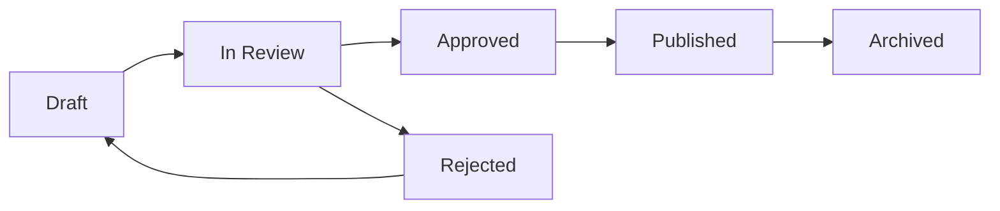

# NRB Europe Admin System Documentation

## Table of Contents
1. [Overview](#overview)
2. [Authentication & Authorization](#authentication--authorization)
3. [User Roles & Permissions](#user-roles--permissions)
4. [Admin Dashboard](#admin-dashboard)
5. [Content Management](#content-management)
6. [Editorial Workflow](#editorial-workflow)
7. [Sanity Studio Integration](#sanity-studio-integration)
8. [API Routes](#api-routes)
9. [Security Features](#security-features)
10. [Usage Guide](#usage-guide)

---

## Overview

The NRB Europe Admin System is a comprehensive content management and editorial workflow system built with Next.js, Sanity CMS, and NextAuth.js. It provides role-based access control, multi-stage editorial workflow, and advanced content management capabilities.

### Key Features
- **Role-Based Access Control (RBAC)**: Four distinct user roles with granular permissions
- **Multi-Stage Editorial Workflow**: Draft → Review → Published pipeline
- **Real-Time Collaboration**: Multiple editors can work simultaneously
- **Content Versioning**: Track all changes with automatic history
- **SEO Optimization**: Built-in SEO tools and Google News compliance
- **Multilingual Support**: Content management in 5 languages (EN, BN, ES, DE, FR)
- **Analytics Dashboard**: Real-time content performance metrics

---

## Authentication & Authorization

### NextAuth.js Configuration
Location: `src/app/api/auth/[...nextauth]/route.ts`

The system uses NextAuth.js for authentication with the following providers:
- **Google OAuth**: Primary authentication method
- **Credentials**: Email/password fallback
- **JWT Strategy**: Secure token-based sessions

```typescript
// Session includes user role and permissions
session: {
  user: {
    id: string
    email: string
    name: string
    role: 'super-admin' | 'editor' | 'contributor' | 'viewer'
  }
}
```

### Protected Routes
All admin routes are protected by middleware:
- `/admin/*` - Requires authentication
- `/api/admin/*` - Requires authentication + role verification

---

## User Roles & Permissions

### Role Hierarchy

#### 1. Super Admin
**Full system access with no restrictions**

Permissions:
- ✅ Create, read, update, delete ALL content
- ✅ Manage user accounts and roles
- ✅ Configure system settings
- ✅ Access analytics and reports
- ✅ Manage categories and tags
- ✅ Delete published content
- ✅ Override editorial workflow
- ✅ Access Sanity Studio admin panel

#### 2. Editor
**Senior content management with approval authority**

Permissions:
- ✅ Create, read, update own content
- ✅ Review and approve submissions
- ✅ Publish approved content
- ✅ Edit contributor content
- ✅ Manage categories and tags
- ✅ Schedule content publication
- ❌ Delete published content (requires super-admin)
- ❌ Manage user accounts
- ✅ Access analytics dashboard

#### 3. Contributor
**Content creation with submission workflow**

Permissions:
- ✅ Create new content (draft status)
- ✅ Read all content
- ✅ Update own draft content
- ✅ Submit content for review
- ✅ View submission status
- ❌ Publish content directly
- ❌ Edit other users' content
- ❌ Delete any content
- ❌ Manage categories

#### 4. Viewer
**Read-only access for monitoring**

Permissions:
- ✅ Read all content
- ✅ View analytics (limited)
- ❌ Create content
- ❌ Edit content
- ❌ Delete content
- ❌ Approve submissions

### Permission Implementation
Location: `src/sanity/admin/roles.ts`

```typescript
export const roles = {
  'super-admin': {
    permissions: ['create', 'read', 'update', 'delete', 'publish'],
    canManageUsers: true,
    canAccessAnalytics: true
  },
  'editor': {
    permissions: ['create', 'read', 'update', 'publish'],
    canManageUsers: false,
    canAccessAnalytics: true
  },
  'contributor': {
    permissions: ['create', 'read', 'update'],
    canManageUsers: false,
    canAccessAnalytics: false
  },
  'viewer': {
    permissions: ['read'],
    canManageUsers: false,
    canAccessAnalytics: false
  }
}
```

---

## Admin Dashboard

### Dashboard Overview
Location: `src/app/admin/dashboard/page.tsx`

The admin dashboard provides a comprehensive overview of:
- **Content Statistics**: Total articles, published, drafts, pending review
- **Recent Activity**: Latest content changes and user actions
- **Workflow Status**: Articles in each editorial stage
- **Quick Actions**: Create content, manage users, view reports
- **Performance Metrics**: Page views, engagement, trending articles

### Key Metrics

```typescript
interface DashboardMetrics {
  totalArticles: number
  publishedArticles: number
  draftArticles: number
  pendingReview: number
  scheduledArticles: number
  totalViews: number
  totalUsers: number
  activeCategories: number
}
```

### Quick Actions Panel
- Create New Article
- Manage Categories
- User Management (Super Admin only)
- View Analytics
- Content Calendar
- SEO Tools

---

## Content Management

### Article Schema
Location: `src/sanity/schemas/post.ts`

```typescript
{
  name: 'post',
  type: 'document',
  fields: [
    { name: 'title', type: 'string', required: true },
    { name: 'slug', type: 'slug', required: true },
    { name: 'author', type: 'reference', to: [{ type: 'author' }] },
    { name: 'mainImage', type: 'image' },
    { name: 'categories', type: 'array', of: [{ type: 'reference' }] },
    { name: 'publishedAt', type: 'datetime' },
    { name: 'body', type: 'blockContent' },
    { name: 'excerpt', type: 'text' },
    { name: 'seo', type: 'seo' },
    { name: 'status', type: 'string' }, // draft | review | published
    { name: 'priority', type: 'string' }, // low | normal | high | breaking
    { name: 'featured', type: 'boolean' },
    { name: 'sticky', type: 'boolean' }
  ]
}
```

### Content Types
1. **Standard Article**: Regular news articles
2. **Breaking News**: High-priority urgent news
3. **Featured Article**: Homepage highlights
4. **Sticky Post**: Pinned to top of category
5. **Scheduled Post**: Auto-publish at specific time

### Content Operations

#### Create Article
```typescript
// API: POST /api/admin/articles
{
  title: string
  slug: string
  body: PortableText
  author: Reference
  categories: Reference[]
  mainImage: ImageAsset
  status: 'draft'
}
```

#### Update Article
```typescript
// API: PATCH /api/admin/articles/[id]
{
  fields: {
    title?: string
    body?: PortableText
    status?: 'draft' | 'review' | 'published'
  }
}
```

#### Delete Article
```typescript
// API: DELETE /api/admin/articles/[id]
// Requires super-admin role
// Soft delete: marks as archived, not permanent deletion
```

---

## Editorial Workflow

### Workflow States



### State Transitions

#### 1. Draft → Review
- **Triggered by**: Contributor submits article
- **Action**: `submitForReview(articleId)`
- **Notifications**: Editor receives review request
- **Required**: Title, body, author, category, SEO metadata

#### 2. Review → Approved/Rejected
- **Triggered by**: Editor reviews submission
- **Actions**: 
  - `approveArticle(articleId, comments)`
  - `rejectArticle(articleId, reason)`
- **Notifications**: Author receives approval/rejection notice
- **Comments**: Editor can add review notes

#### 3. Approved → Published
- **Triggered by**: Editor or Super Admin
- **Action**: `publishArticle(articleId, publishDate?)`
- **Options**: 
  - Immediate publication
  - Scheduled publication (future date)
- **Validations**: 
  - SEO compliance check
  - Google News validation
  - Image optimization check

#### 4. Published → Archived
- **Triggered by**: Manual archival or auto-archive (90+ days)
- **Action**: `archiveArticle(articleId)`
- **Effect**: Removed from public site, retained in admin

### Workflow API
Location: `src/app/api/admin/workflow/route.ts`

```typescript
// Submit for review
POST /api/admin/workflow/submit
Body: { articleId: string }

// Approve submission
POST /api/admin/workflow/approve
Body: { articleId: string, comments?: string }

// Reject submission
POST /api/admin/workflow/reject
Body: { articleId: string, reason: string }

// Publish article
POST /api/admin/workflow/publish
Body: { articleId: string, publishDate?: string }

// Schedule publication
POST /api/admin/workflow/schedule
Body: { articleId: string, publishDate: string }
```

### Content Review Checklist
- [ ] Title meets SEO guidelines (10-110 characters)
- [ ] Article has minimum 80 words (Google News requirement)
- [ ] Main image is optimized (WebP format, <500KB)
- [ ] Author is assigned
- [ ] Categories are appropriate
- [ ] Slug is SEO-friendly
- [ ] Meta description is compelling (150-160 characters)
- [ ] Content is factual and properly sourced
- [ ] Language/grammar is correct
- [ ] No copyright violations

---

## Sanity Studio Integration

### Studio Configuration
Location: `sanity.config.ts`

```typescript
export default defineConfig({
  name: 'nrb-europe',
  title: 'NRB Europe',
  
  projectId: process.env.NEXT_PUBLIC_SANITY_PROJECT_ID!,
  dataset: process.env.NEXT_PUBLIC_SANITY_DATASET!,
  
  plugins: [
    deskTool(),
    visionTool(),
    colorInput(),
    imageHotspotArrayPlugin(),
  ],
  
  schema: {
    types: schemaTypes,
  },
})
```

### Studio Features

#### 1. Document Actions
Custom actions available in Studio:
- **Publish with SEO Check**: Validates SEO before publishing
- **Schedule Publication**: Set future publish date
- **Create Translation**: Generate multilingual versions
- **Duplicate Article**: Clone with new slug
- **Export to PDF**: Generate PDF version

#### 2. Custom Input Components
- **Slug Generator**: Auto-generates SEO-friendly slugs
- **Image Optimizer**: Compresses images on upload
- **SEO Preview**: Real-time Google/social preview
- **Word Counter**: Live word count for Google News compliance

#### 3. Document Badges
Visual indicators in Studio:
- 🟢 Published
- 🟡 In Review
- 🔴 Draft
- 📌 Featured
- ⚡ Breaking News
- 📅 Scheduled

### Studio Access
URL: `/studio`

Access levels:
- **Super Admin**: Full Studio access
- **Editor**: Edit and publish capabilities
- **Contributor**: Create and edit own content
- **Viewer**: Read-only access

---

## API Routes

### Authentication APIs

```typescript
// Login
POST /api/auth/signin
Body: { email: string, password: string }
Response: { user, token }

// Logout
POST /api/auth/signout
Response: { success: true }

// Session check
GET /api/auth/session
Response: { user, role, permissions }
```

### Content Management APIs

```typescript
// Get all articles (with filters)
GET /api/admin/articles?status=draft&author=abc123
Response: { articles: Article[], total: number }

// Get single article
GET /api/admin/articles/[id]
Response: { article: Article }

// Create article
POST /api/admin/articles
Body: { title, body, author, ... }
Response: { article: Article }

// Update article
PATCH /api/admin/articles/[id]
Body: { fields: Partial<Article> }
Response: { article: Article }

// Delete article
DELETE /api/admin/articles/[id]
Response: { success: true }
```

### User Management APIs (Super Admin only)

```typescript
// Get all users
GET /api/admin/users
Response: { users: User[] }

// Update user role
PATCH /api/admin/users/[id]/role
Body: { role: 'editor' | 'contributor' | 'viewer' }
Response: { user: User }

// Deactivate user
POST /api/admin/users/[id]/deactivate
Response: { success: true }
```

### Analytics APIs

```typescript
// Get dashboard metrics
GET /api/admin/analytics/metrics
Response: { metrics: DashboardMetrics }

// Get article performance
GET /api/admin/analytics/articles/[id]
Response: { views, shares, engagement }

// Get trending articles
GET /api/admin/analytics/trending
Response: { articles: Article[] }
```

### Category Management APIs

```typescript
// Get all categories
GET /api/admin/categories
Response: { categories: Category[] }

// Create category
POST /api/admin/categories
Body: { title, slug, description }
Response: { category: Category }

// Update category
PATCH /api/admin/categories/[id]
Body: { fields: Partial<Category> }
Response: { category: Category }

// Delete category
DELETE /api/admin/categories/[id]
Response: { success: true }
```

---

## Security Features

### 1. Authentication Security
- **JWT Tokens**: Secure, signed tokens with expiration
- **HTTP-Only Cookies**: Prevents XSS attacks
- **CSRF Protection**: Token validation on state-changing requests
- **Rate Limiting**: Max 100 requests per minute per IP
- **Password Hashing**: bcrypt with salt rounds

### 2. Authorization Checks
```typescript
// Middleware validates every request
async function authorize(req: Request, requiredRole: Role) {
  const session = await getServerSession(authOptions)
  
  if (!session?.user) {
    throw new UnauthorizedError()
  }
  
  if (!hasPermission(session.user.role, requiredRole)) {
    throw new ForbiddenError()
  }
  
  return session.user
}
```

### 3. Content Security
- **Input Sanitization**: All user input is sanitized
- **XSS Prevention**: Content Security Policy headers
- **SQL Injection**: Sanity's secure query API prevents injection
- **Image Upload Validation**: File type, size, dimensions checked
- **Rate Limiting**: Content creation limited to 10 articles/hour

### 4. Audit Logging
All actions are logged:
```typescript
{
  timestamp: Date
  userId: string
  action: 'create' | 'update' | 'delete' | 'publish'
  resource: 'article' | 'user' | 'category'
  resourceId: string
  changes: object
  ipAddress: string
  userAgent: string
}
```

### 5. Data Privacy
- **GDPR Compliance**: User data can be exported/deleted
- **Data Encryption**: Sensitive data encrypted at rest
- **Secure Transmission**: All traffic over HTTPS
- **Minimal Data Collection**: Only essential data stored

---

## Usage Guide

### For Super Admins

#### Initial Setup
1. **Configure Environment Variables**
   ```env
   NEXT_PUBLIC_SANITY_PROJECT_ID=your-project-id
   NEXT_PUBLIC_SANITY_DATASET=production
   SANITY_API_TOKEN=your-token
   NEXTAUTH_SECRET=your-secret
   NEXTAUTH_URL=https://your-domain.com
   ```

2. **Create First Super Admin**
   ```bash
   npm run create-admin
   # Follow prompts to create super admin account
   ```

3. **Configure Sanity Studio**
   - Access `/studio`
   - Configure CORS origins
   - Set up API tokens
   - Configure webhooks

#### User Management
1. Navigate to **Admin Dashboard** → **Users**
2. Click **Add User**
3. Fill in user details (name, email, role)
4. Click **Create User**
5. User receives invitation email

#### System Configuration
- **Categories**: Manage from Dashboard → Categories
- **Tags**: Auto-generated from content
- **SEO Settings**: Dashboard → Settings → SEO
- **Analytics**: Dashboard → Settings → Analytics

### For Editors

#### Daily Workflow
1. **Review Pending Submissions**
   - Dashboard → **Pending Review** (shows count)
   - Read through submitted articles
   - Check SEO compliance
   - Add editorial comments

2. **Approve/Reject Articles**
   - Click **Approve** or **Reject**
   - Add comments explaining decision
   - If approved, optionally schedule publication

3. **Publish Articles**
   - Dashboard → **Approved Articles**
   - Review final version
   - Set publish date/time
   - Click **Publish**

4. **Monitor Performance**
   - Dashboard → **Analytics**
   - Track trending articles
   - Review engagement metrics

#### Content Review Tips
- Check article meets 80-word minimum (Google News)
- Verify title is 10-110 characters
- Ensure main image is present and optimized
- Confirm author attribution
- Validate all links are working
- Check for spelling/grammar issues

### For Contributors

#### Creating Articles

1. **Start New Article**
   - Dashboard → **Create Article**
   - Choose article type (Standard/Breaking)

2. **Write Content**
   - Enter compelling title (10-110 chars)
   - Write article body (minimum 80 words)
   - Add categories (at least one)
   - Upload main image (optimized)

3. **SEO Optimization**
   - Auto-generated slug (editable)
   - Write meta description (150-160 chars)
   - Add keywords (comma-separated)
   - Preview Google/social appearance

4. **Save Draft**
   - Click **Save Draft** (saves progress)
   - Return later to continue editing
   - Draft auto-saves every 30 seconds

5. **Submit for Review**
   - Click **Submit for Review**
   - Add notes for editor (optional)
   - Wait for approval/rejection

#### Article Status Tracking
- **Draft**: Work in progress
- **In Review**: Submitted to editor
- **Approved**: Ready to publish
- **Published**: Live on site
- **Rejected**: Needs revision (check comments)

### For Viewers

#### Read-Only Access
- View all content in dashboard
- See limited analytics (public metrics only)
- Cannot create, edit, or delete content
- Can export reports

---

## Troubleshooting

### Common Issues

#### 1. Cannot Login
**Problem**: Authentication fails
**Solutions**:
- Clear browser cookies
- Check email/password
- Verify account is active
- Contact super admin

#### 2. Cannot Publish Article
**Problem**: Publish button disabled
**Solutions**:
- Check user role (contributors cannot publish)
- Verify article is approved
- Ensure all required fields are filled
- Check SEO validation passed

#### 3. Images Not Uploading
**Problem**: Image upload fails
**Solutions**:
- Check file size (<5MB)
- Verify file type (JPG, PNG, WebP only)
- Check internet connection
- Try different image

#### 4. Sanity Studio Not Loading
**Problem**: Studio page shows error
**Solutions**:
- Check Sanity project ID in `.env.local`
- Verify API token is valid
- Clear browser cache
- Check CORS settings in Sanity

#### 5. Session Expired
**Problem**: Logged out unexpectedly
**Solutions**:
- Sessions expire after 7 days
- Re-login to continue
- Enable "Remember me" for longer sessions

### Getting Help

**Technical Support**:
- Email: support@nrbeurope.com
- Documentation: https://docs.nrbeurope.com
- GitHub Issues: https://github.com/nrbeurope/issues

**Training Resources**:
- Video Tutorials: `/admin/help/videos`
- User Guide PDF: `/admin/help/guide.pdf`
- FAQ: `/admin/help/faq`

---

## System Requirements

### Browser Support
- Chrome 90+ (recommended)
- Firefox 88+
- Safari 14+
- Edge 90+

### Network Requirements
- Minimum 5 Mbps upload speed (for image uploads)
- Stable internet connection
- HTTPS enabled

### Device Support
- Desktop: Full functionality
- Tablet: Content creation and editing
- Mobile: Read-only dashboard access

---

## Version History

### v2.0.0 (Current)
- ✅ Multi-stage editorial workflow
- ✅ Role-based access control
- ✅ Real-time collaboration
- ✅ Content versioning
- ✅ Analytics dashboard
- ✅ Multilingual support (5 languages)
- ✅ SEO optimization tools
- ✅ Automated testing suite

### v1.5.0
- Basic admin dashboard
- Single-stage approval
- User management

### v1.0.0
- Initial release
- Basic content management

---

## Best Practices

### Content Creation
1. **Always use SEO tools** before publishing
2. **Write compelling headlines** (front-load important words)
3. **Add relevant images** (WebP format, optimized)
4. **Use categories consistently** (max 3 per article)
5. **Proofread before submitting** (spell-check, grammar)
6. **Add meta descriptions** (unique for each article)
7. **Include internal links** (2-3 related articles)

### Editorial Review
1. **Review within 24 hours** of submission
2. **Provide constructive feedback** when rejecting
3. **Check fact accuracy** (verify sources)
4. **Maintain editorial standards** (style guide)
5. **Schedule strategically** (publish during peak hours)

### User Management
1. **Assign appropriate roles** (principle of least privilege)
2. **Regular access audits** (quarterly review)
3. **Deactivate unused accounts** (after 90 days inactivity)
4. **Strong password policy** (minimum 12 characters)
5. **Enable 2FA for admins** (additional security layer)

---

## Performance Optimization

### Dashboard Loading
- Cached metrics (refreshed every 5 minutes)
- Lazy loading of article lists
- Pagination (50 articles per page)
- Optimized database queries

### Image Handling
- Automatic WebP conversion
- Responsive image variants
- CDN delivery (Sanity CDN)
- Lazy loading below fold

### API Performance
- Response caching (5-minute TTL)
- Rate limiting prevents overload
- Database connection pooling
- Optimized GROQ queries

---

## Future Enhancements

### Planned Features
- [ ] AI-powered content suggestions
- [ ] Advanced analytics (heatmaps, scroll tracking)
- [ ] Mobile app for content management
- [ ] Automated translation workflow
- [ ] A/B testing for headlines
- [ ] Content recommendation engine
- [ ] Social media auto-posting
- [ ] Video content management
- [ ] Podcast management
- [ ] Newsletter builder

---

## Glossary

- **RBAC**: Role-Based Access Control - permission system based on user roles
- **Portable Text**: Sanity's rich text format (similar to Markdown)
- **GROQ**: Graph-Relational Object Queries - Sanity's query language
- **JWT**: JSON Web Token - secure authentication token
- **CSRF**: Cross-Site Request Forgery - security vulnerability
- **XSS**: Cross-Site Scripting - security vulnerability
- **CDN**: Content Delivery Network - distributed file hosting
- **SEO**: Search Engine Optimization - improving search rankings
- **PWA**: Progressive Web App - app-like website
- **AMP**: Accelerated Mobile Pages - fast mobile format

---

## Contact Information

**Development Team**:
- Lead Developer: dev@nrbeurope.com
- Technical Support: support@nrbeurope.com

**Emergency Contact** (Critical Issues):
- Phone: +44 xxx xxxx xxxx
- Email: emergency@nrbeurope.com

**Business Hours**:
- Monday - Friday: 9:00 AM - 6:00 PM GMT
- Weekend: Emergency support only

---

*Last Updated: January 30, 2026*
*Version: 2.0.0*
*Document maintained by NRB Europe Development Team*
